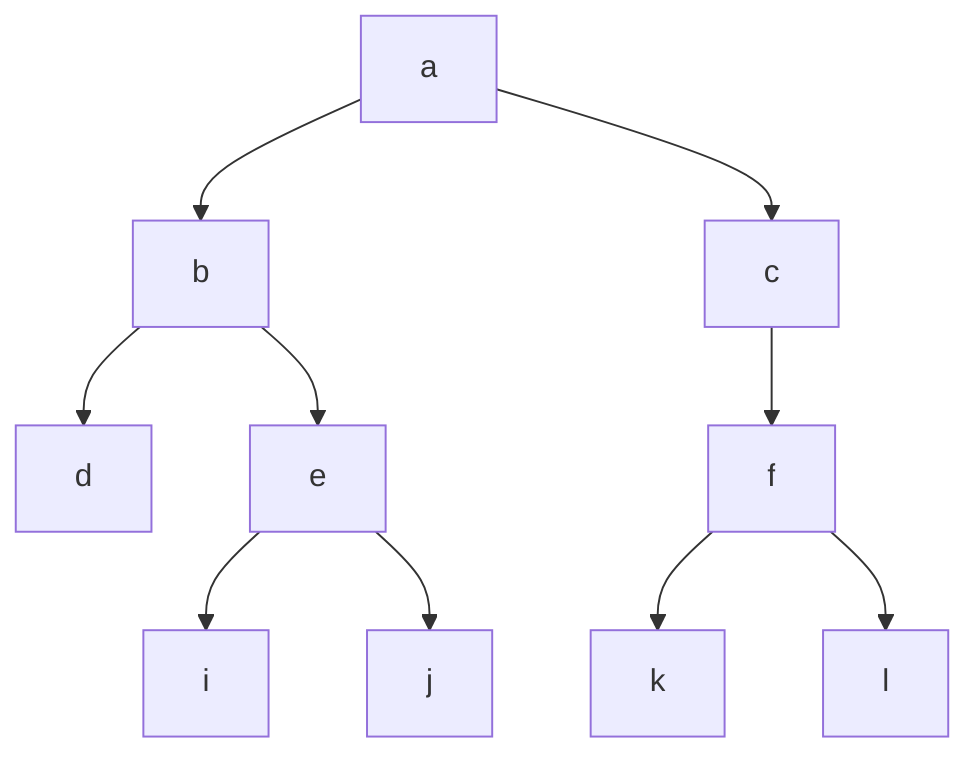
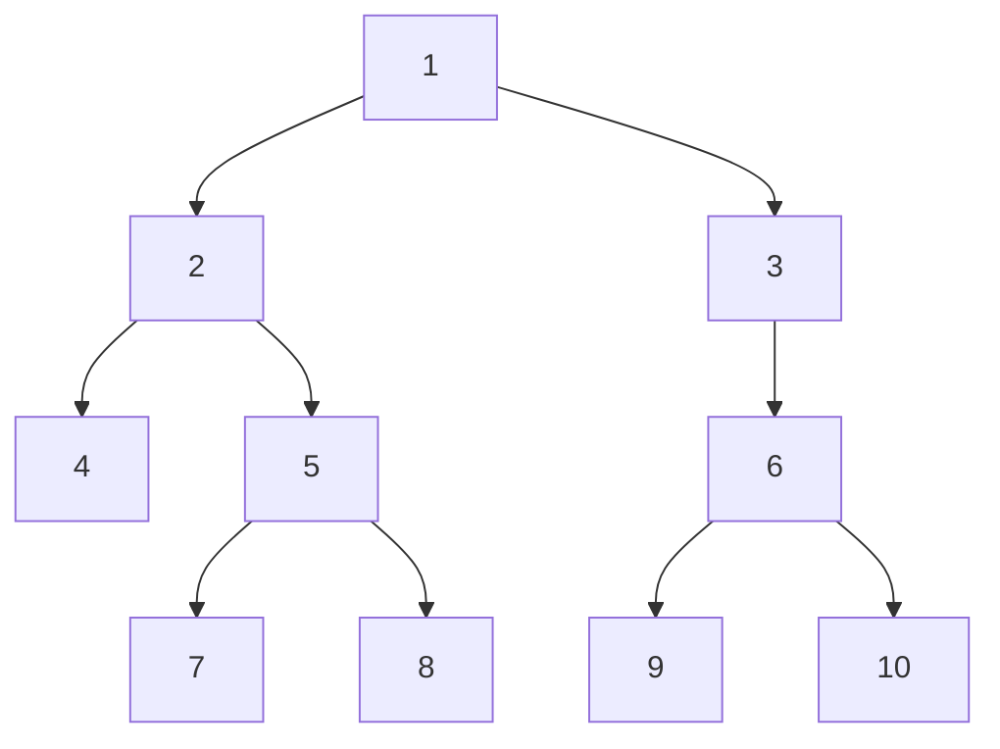

# 树的简介
## 树的定义:
> 只有一个前趋结点，0个或多个后趋节点。不能形成闭环，有闭环的就是图的结构，如下图

**<center>树</center>**
## 常见概念
>1.根节点:第一个节点,只有一个(a)

>2.左子树,右子树

>3.父节点:某节点的上一个节点,根节点就没有父节点(b是e的父节点)

>4.祖父节点(b是j的祖父节点)

>5.兄弟节点:同层的(d,e,f)

>6.中间节点.子节点:有父节点也有子节点(b,e,c,f)

>7.叶子节点:最后一层节点(d,i,j,k,l)

>8.节点的高度：根节点到该节点的层数(e节点高度：3)

>9.树的深度:整个树的高度(4)

>10.层:(根是第一层，b.c第二层)

## 树逻辑的作用
> 用来描述或存储具有层级逻辑的数据,即非线性逻辑的数据,相当于有小分类
>比如:族谱,字典

>不能说这种数据不能用链表,数组来存
>而是说用树来处理这种关系来处理这种类型的数据
>逻辑更加清晰,合适,能看出来数据节点的关系

>应用二叉树有着非常明确的规律,程度简易
>因此被主要应用
>三叉树,四叉树用起来的逻辑比较复杂,不适用于常规

## 二叉树的种类
>二叉树的种类:二叉排序树,二叉搜索树,平衡二叉树,红黑树,哈夫曼树,B树,多叉树...要学很多种。

>课程:以写代码为主,概念类的知识为辅助

>主要内容:树创建,增,删,改,查,各种逻辑


## 创建一颗模拟的二叉树，结构如下：

```bash
#include <stdio.h>
struct treeNode
{
    int a;   // 数据成员
    // pFather 操作更灵活
    struct treeNode* pFather;  // 对1.2来说,2又有一个指针指向1,相当于双向链表
    struct treeNode* pLeft;
    struct treeNode*pRight;
}

int main()
{
    struct treeNode t1 = { 1 }; // 第一个元素是1,其他初始化为0
    struct treeNode t2 = { 2 };
    struct treeNode t3 = { 3 };
    struct treeNode t4 = { 4 };
    struct treeNode t5 = { 5 };
    struct treeNode t6 = { 6 };
    struct treeNode t7 = { 7 };
    struct treeNode t8 = { 8 };
    struct treeNode t9 = { 9 };
    struct treeNode t10 ={10 }; 


    ......

    
    return 0;
}
```
