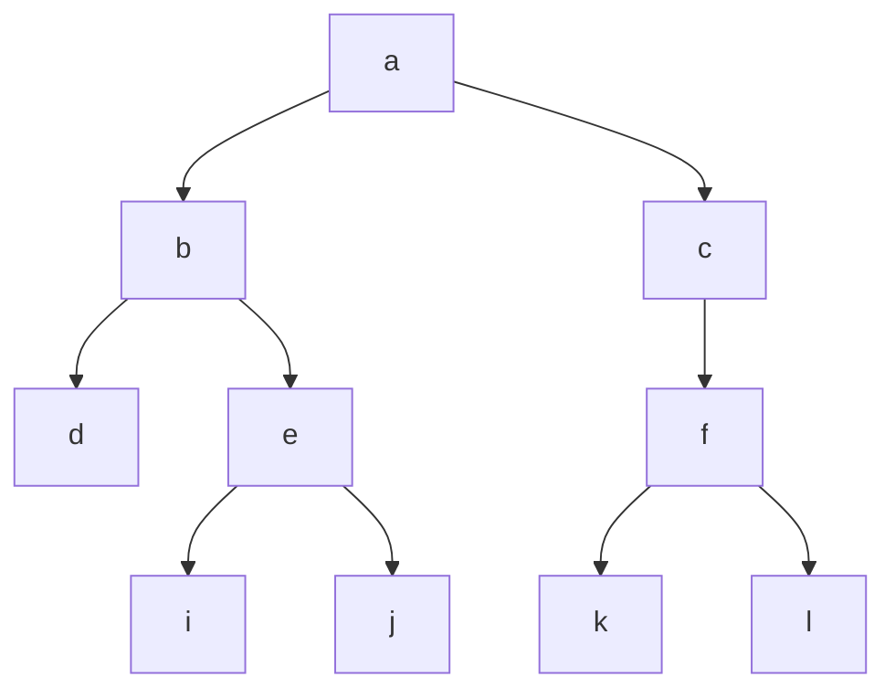
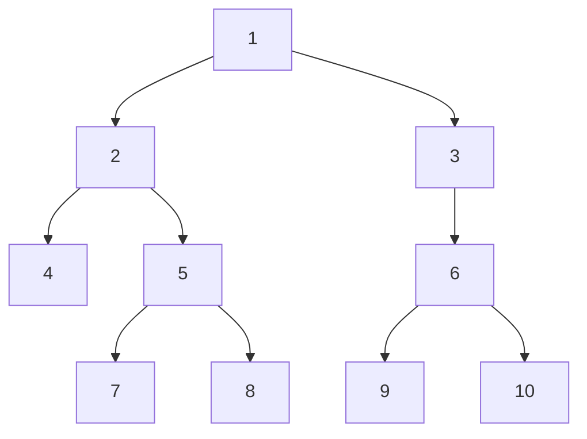

# Introduction To Trees

### 树的定义:
> 只有一个前趋结点，0个或多个后趋节点。不能形成闭环，有闭环的就是图的结构，如下图

**<center>树</center>**
### 常见概念
>1.根节点:第一个节点,只有一个(a)

>2.左子树,右子树

>3.父节点:某节点的上一个节点,根节点就没有父节点(b是e的父节点)

>4.祖父节点(b是j的祖父节点)

>5.兄弟节点:同层的(d,e,f)

>6.中间节点.子节点:有父节点也有子节点(b,e,c,f)

>7.叶子节点:最后一层节点(d,i,j,k,l)

>8.节点的高度：根节点到该节点的层数(e节点高度：3)

>9.树的深度:整个树的高度(4)

>10.层:(根是第一层，b.c第二层)

### 树逻辑的作用
用来`描述`或存`储具`有`层级逻辑`的数据,即`非线性逻辑`的数据,相当于`有小分类`
比如:族谱,字典

>不能说这种数据不能用链表,数组来存
>而是说用树来处理这种关系来处理这种类型的数据
>逻辑更加清晰,合适,能看出来数据节点的关系

>应用二叉树有着非常明确的规律,程度简易
>因此被主要应用
>三叉树,四叉树用起来的逻辑比较复杂,不适用于常规

### 二叉树的种类
>二叉树的种类:二叉排序树,二叉搜索树,平衡二叉树,红黑树,哈夫曼树,B树,多叉树...要学很多种。

>课程:以写代码为主,概念类的知识为辅助

>主要内容:树创建,增,删,改,查,各种逻辑


## Simulate Binary Tree

### 创建一颗模拟的二叉树，结构如下：


```cpp
#include <stdio.h>
struct treeNode
{
    int a;   // 数据成员
    // pFather 操作更灵活
    struct treeNode* pFather;  // 对1.2来说,2又有一个指针指向1,相当于双向链表
    struct treeNode* pLeft;
    struct treeNode*pRight;
}

int main()
{
    struct treeNode t1 = { 1 }; // 第一个元素是1,其他初始化为0
    struct treeNode t2 = { 2 };
    struct treeNode t3 = { 3 };
    struct treeNode t4 = { 4 };
    struct treeNode t5 = { 5 };
    struct treeNode t6 = { 6 };
    struct treeNode t7 = { 7 };
    struct treeNode t8 = { 8 };
    struct treeNode t9 = { 9 };
    struct treeNode t10 ={10 }; 


    ......

    
    return 0;
}
```
## Check Creation Result with Breakpoints
### check creation result with breakpoints

二叉树的遍历逻辑有四种，分别是:`前序遍历`,`中序遍历`,`后序遍历`,`层序遍历`.层序遍历也叫`广度遍历`.前中后指的是`根的顺序`

There are four traversal logics for a binary tree: `pre-order traversal`, `in-order traversal`, `post-order traversal`, and `level-order traversal` (also known as `breadth-first traversal`). The terms "pre", "in", and "post" refer to the order of visiting the root node.

## Binary Tree Traversal
### Pre-order Traversal
#### Textual Process Analysis
`前序遍历逻辑为：根 左 右`

`The logic of pre-order traversal is: Root → Left → Right`

- 1 2 3 的三角形，输出顺序 `1 2 3`
For the triangle of 1, 2, 3, the output order is `1 2 3`

- 2 是 2 4 5 三角形的根，顺序 `1 (2 4 5) 3`
2 is the root of the triangle of 2, 4, 5, with the order `1 (2 4 5) 3`
- 5 是 5 7 8 三角形的根，顺序 `1 (2 4(5 7 8)) 3`
5 is the root of the triangle of 5, 7, 8, with the order `1 (2 4(5 7 8)) 3`
- 左子树拆解完毕
The left subtree is disassembled completely

- 3 是 3 6 三角形的根,无左,顺序 `1 (2 4(5 7 8)) (3 6)`
3 is the root of the triangle of 3, 6 with no left child, with the order `1 (2 4(5 7 8))(3 6)`
3 is the root of the triangle of 3, 6 with no left child, with the order `1 (2 4(5 7 8))(3 (6 9 10))`
- 6 是 6 9 10 三角形的根，顺序
 3 is the root of the triangle of 3, 6 with no left child, with the order `1 (2 4(5 7 8))(3 (6 9 10))`
6 is the root of the triangle of 6, 9, 10, with the order 6 → 9 → 10


```mermaid
flowchart TD
1-->2
1-->3ndci
2-->4c klbcbc 
2-->5
5-->7
5-->8
3-->6
6-->9
6-->10
```

```
二叉树先序遍历结果为：1 2 4 5 7 8 3 6 9 10
The result of the binary tree pre-order traversal is: 1 2 4 5 7 8 3 6 9 10
```
##### 前序遍历的的递归函数
```cpp
#include <stdio.h>
struct treeNode
{
    int a;   // 数据成员
    // pFather 操作更灵活
    struct treeNode* dad;  // 对1.2来说,2又有一个指针指向1,相当于双向链表
    struct treeNode* left;
    struct treeNode*right;
};

void look(struct treeNode* root)
{
    if (NULL == root)
    {
        return;
    }
    printf("%d ", root->a);
    look(root->left);   // 递归左子树
    look(root->right);  // 递跪右子树
}

int main()
{
    struct treeNode t1 = { 1 }; // 第一个元素是1,其他初始化为0
    struct treeNode t2 = { 2 };
    struct treeNode t3 = { 3 };
    struct treeNode t4 = { 4 };
    struct treeNode t5 = { 5 };
    struct treeNode t6 = { 6 };
    struct treeNode t7 = { 7 };
    struct treeNode t8 = { 8 };
    struct treeNode t9 = { 9 };
    struct treeNode t10 ={10 }; 

    t1.left = &t2;
    t1.right = &t3;

    t2.left = &t4;
    t2.right = &t5;
    t2.dad = &t1;

    t3.left = &t6;
    t3.right = NULL;
    t3.dad = &t1;

    t4.left = NULL;
    t4.right = NULL;
    t4.dad = &t2;

    t5.left = &t7;
    t5.right = &t8;
    t5.dad = &t2;
    
    t6.left = &t9;
    t6.right = &t10;
    t6.dad = &t3;

    t7.left = NULL;
    t7.right = NULL;
    t7.dad = &t5;

    t8.left = NULL;
    t8.right = NULL;
    t8.dad = &t5;

    t9.left = NULL;
    t9.right = NULL;
    t9.dad = &t6;

    t10.left = NULL;
    t10.right = NULL;
    t10.dad = &t6;
    
    look(&t1);

    return 0;
}
```


#### Textual Process Analysis
### Pre-order Traversal (Non-recursive)
递归算法：由入栈出栈实现
递归就是栈的使用逻辑：先进后出，井的样式
#### Stack Push Process Analysis
前序遍历利用栈的实现逻辑：
根 左 右：节点入栈并输出，入到叶子节点，出栈父节点遍历右子树
1、1入并输出，2入并输出，4入并输出，到叶子了 栈：4 2 1
2、出栈顶(4节点)，无右子树 栈：2 1
3、出栈顶(2节点)，有右子树，右子树继续输出并入栈 栈：1
4、5入并输出，7入并输出，到叶子了 栈：7 5 1
5、出栈顶(7节点)，无右子树 栈：5 1
6、出栈顶(5节点)，有右子树，右子树继续输出并入栈 栈：1
7、8入并输出，到叶子了 栈：8 1
8、出栈顶(8节点)，无右子树 栈：1
9、出栈顶(1节点)，有右子树，右子树继续输出并入栈 栈：NULL
10、3入并输出，无左子树，到叶子了 栈：3
11、出栈顶(3节点)，有右子树，右子树继续输出并入栈 栈：NULL
#### Stack Implementation Analysis
栈实现分析
`栈`：`链表`结构的栈，代码稍多一些
`数组`结构的栈，数组元素个数为树的层数，节点多(malloc,new 数组)
<br>
选择：
如果树的`层数`很多，或者`未知层数`(数据个数是动态的，即程序运行期间会大量采集)，采用`链表`形式的栈比较合适
如果树的`层数已知`，并且`层数不多`，我觉得 100 或者 200 层都不算多，所以这个多少的程度，不同人感觉都不一样
<br>
问题对比思考原因： 
数组是固定大小的空间，比如 100，就一直是 100，即使栈出空了，也依然是占据 100 的空间
链表是动态的，出一个没一个，全出就空了，不占空间，所以空间利用率上会高一些 当然是建立在大量的数据的基础上 几万 几十万 上百万的数据
### Pre-order Traversal (Recursive)
####  Stack Push Code
#### Stack Pop Code
####  Traversal cfhhijcvyufdtubukjgkcyfkyvyffhf